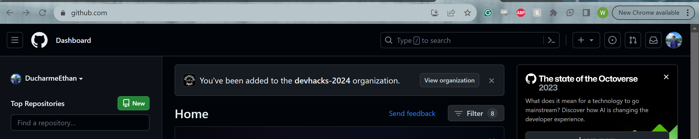
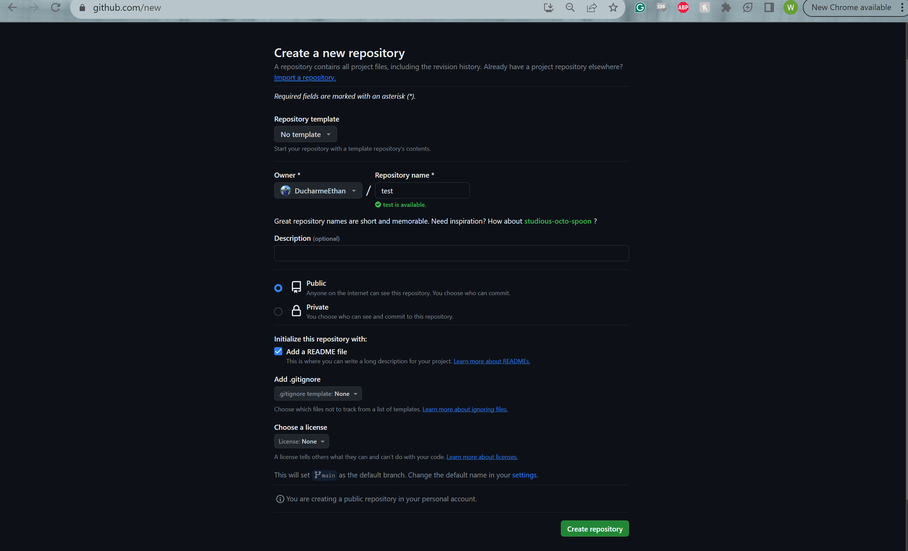

# Hosting Your Resume with GitHub Pages: A Modern Approach

## Purpose

- This README serves as a guide to hosting your resume on GitHub Pages, integrating the principles of Andrew Etter's Modern Technical Writing.

## Prerequisites

- Ensure you have a well-formatted resume in Markdown. If you need guidance on Markdown, refer to this [tutorial](https://mszep.github.io/pandoc_resume/).
- An account with GitHub. If you do not have one please follow this [guide](https://docs.github.com/en/get-started/start-your-journey/creating-an-account-on-github) to create one.

## Instructions

### 1. Setting Up Your GitHub Repository

- Navigate to your GitHub account at https://github.com/.
- Create a new repository named your-username.github.io (replace "your-username" with your actual GitHub username) by clicking on the green new button as show below. 
- Fill out the required repository name on the page ensuring that the public option is selected and the Add a README file is set. Click Create Repository and you have set up the repository! 
-

### 2. Preparing Your Resume in Markdown

- Open your preferred Markdown editor.
- Create a new Markdown file for your resume.
- Follow GitHub Flavoured Markdown (GFM) guidelines for formatting.

### 3. Integrating Jekyll

- If you wish to explore Jekyll see the link here.
- Select a Jekyll theme that suits your preferences. This can be added to your github pages by adding a \_config.yml file with the following code:
  `remote_theme: pages-themes/"Your Chosen Theme" plugins: -jekyll-remote-theme`

### 4. Uploading Your Resume

- Add your Markdown resume file to the repository.
- Commit the changes and push them to GitHub.

### 5. Activating GitHub Pages

- Go to your repository on GitHub.
- Navigate to the "Settings" tab.
- Scroll down to the "GitHub Pages" section.
- Choose the branch containing your resume Markdown file.
- Save the settings.

### 6. Verify Your Website

- Access <https://your-username.github.io> in your browser.
- Ensure your resume is displayed correctly.

## More Resources

- [Link](https://mszep.github.io/pandoc_resume/) to markdown resume creation guide.
- Purchase Andrew Etter's Modern Technical Writing: An Introduction to Software Documentation [here](https://www.amazon.ca/Modern-Technical-Writing-Introduction-Documentation-ebook/dp/B01A2QL9SS)!
- Check out the official Jekyll [documentation](https://jekyllrb.com/docs/).
- For more information on GIT and GitHub check out their documentation seen at this [link](https://github.com/git-guides).

## Authors and Acknowledgements

- My thanks goes out to [Matt Graham](https://twitter.com/mattgraham) for the use of the midnight theme as well as my group members Lyle Arcinas and Ben Clark for the extra eyes to correct errors.

## FAQS

### 1. Why is Markdown better than a word processor?

- Markdown offers simplicity, version control compatibility, and ease of collaboration. It also ensures consistent formatting across different platforms.

### 2. Why is my resume not showing up?

- Double-check your GitHub Pages settings, repository structure, and file names. Ensure the Markdown file is in the correct branch, and there are no typos in the file extension as these can all be causes of the resume not loading correctly.
